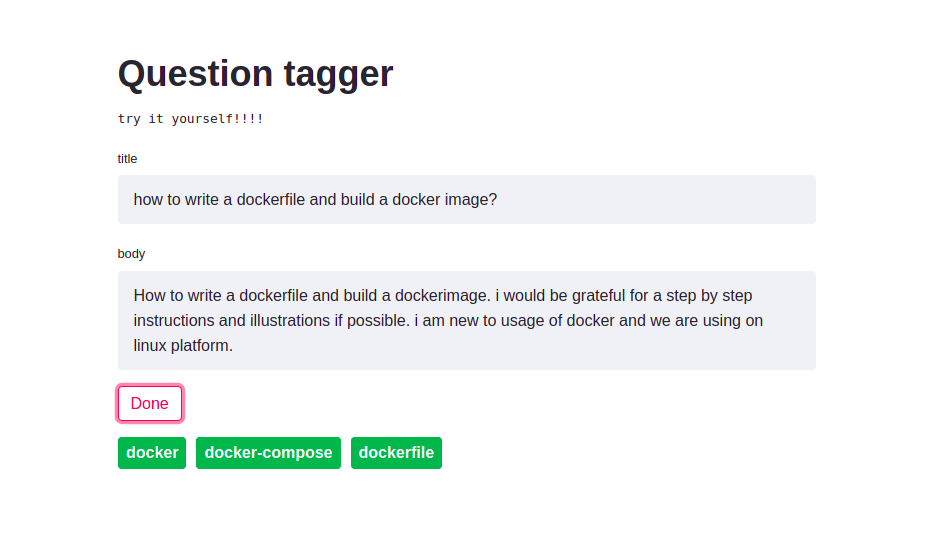

# StackOverflow Question Tagger

StackOverflow allows users to tag their queries with appropriate tag names. This project is about predicting tags automatically for given questio and description.

# Embedding
Embedding for the text are generated using BERT tokenizer using transformers library. 

# model
`bert-base-uncased` model along with fully connected layer is used as predicting model. 

# API
API has been built using `FastAPI`

To start API: run command `uvicorn api:app`   
url: `http://localhost:8000/`

check documentation for [FastAPI](https://fastapi.tiangolo.com/)

# UI
UI has been designed using streamlit

To run UI: run command `streamlit run src/app.py`  
url: `http://localhost:8501/`

# output sample

